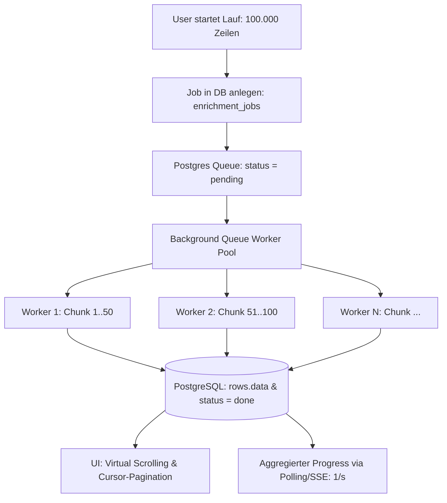

# Architektur- & Skalierungsplan: 100.000+ Zeilen Enrichment

## 1. Status Quo & Herausforderungen bei 100.000+ Zeilen

Aktuell läuft die Anreicherung über einen einzelnen HTTP-Stream (`/api/run/column/stream`) direkt an den Browser:
- **Speicher im Browser:** 100.000 Zeilen im DOM/React-State verbrauchen mehrere Gigabyte RAM und bringen den Tab zum Absturz.
- **Verbindungs-Abhängigkeit:** Ein Tab-Reload, Browser-Schlafmodus oder Verbindungsverlust unterbricht den SSE-Stream.
- **Durchsatz & Dauer:** Bei 1 Zeile/s dauert ein Lauf über 100.000 Zeilen ca. 27 Stunden. Um in < 1 Stunde fertig zu werden, werden 30–50 parallele Worker benötigt.

---

## 2. Ziel-Architektur



---

## 3. Die 4 Kern-Bausteine

### A. Postgres Job Queue & Chunks (`enrichment_jobs`)
1. **Neue Tabelle `enrichment_jobs`:**
   - `id`, `case_id`, `column_id`, `status` (pending | running | paused | completed | error), `total_rows`, `processed_rows`, `failed_rows`, `created_at`, `updated_at`.
2. **Chunking via `FOR UPDATE SKIP LOCKED`:**
   - Worker holen sich atomar Chunks von z. B. 50 Zeilen ab:
     ```sql
     SELECT id FROM rows 
     WHERE case_id = $1 AND (cell_statuses->>$2 IS NULL OR cell_statuses->>$2 = 'idle')
     LIMIT 50 
     FOR UPDATE SKIP LOCKED;
     ```
   - Verhindert Race Conditions bei parallelen Workern vollständig.
   - **Vollständige Entkopplung:** Browser kann jederzeit geschlossen werden; Job läuft server-seitig autark weiter.

### B. Durchsatz, Parallelität & Adaptive Rate Limits
1. **Parallelität:**
   - Einstellbar von 10x bis 50x (Server-Side Concurrency).
   - Dynamische Pool-Größe basierend auf Provider-Antwortzeiten.
2. **Rate Limiting & Queue-Drosselung:**
   - Token-Bucket / Leaky-Bucket pro API-Provider (Eden AI, Firecrawl, SerpAPI).
   - Bei HTTP 429 automatischer Backoff für den gesamten Worker-Pool, nicht nur für den einzelnen Thread.
3. **Scrape-Caching:**
   - Vorab-Prüfung in `scrape_cache`: Ist die Domain bereits gescrapt? → 0 Sekunden Wartezeit + $0 Kosten für wiederholte Domains.

### C. Frontend: Virtual Scrolling & Server-Side Pagination
1. **DOM-Virtualisierung (`@tanstack/react-virtual`):**
   - Es werden nur die ~30 bis 40 tatsächlich im Viewport sichtbaren Zeilen gerendert.
   - 100.000 Zeilen im DOM verbrauchen dadurch nicht mehr RAM als 100 Zeilen.
2. **Index-basierte Pagination:**
   - Statt `SELECT * FROM rows` (lädt 100.000 Zeilen auf einmal) wird seitenweise per Cursor geladen:
     ```sql
     SELECT * FROM rows WHERE case_id = $1 ORDER BY row_index ASC LIMIT 100 OFFSET $2;
     ```

### D. Aggregiertes Progress-Reporting
- Statt 100.000 einzelne SSE-Events an das Frontend zu streamen:
- Der Server aktualisiert den Job-Status in Postgres und sendet alle 1–2 Sekunden einen aggregierten Heartbeat:
  ```json
  {
    "jobId": "job_123",
    "processed": 14250,
    "total": 100000,
    "speed": "42 rows/s",
    "etaSeconds": 2041,
    "currentCostUsd": 7.12
  }
  ```

---

## 4. Schrittweiser Umsetzungsplan

### Phase 1: Entlastung des Frontends (Kurzfristig)
- [ ] `@tanstack/react-virtual` in [components/GroupedTableView.tsx](components/GroupedTableView.tsx) oder der Haupttabelle integrieren.
- [ ] Server-Side Paginierungs-Endpoint (`/api/rows?limit=100&page=0`) etablieren, damit nicht alle 100.000 Zeilen initial ins JSON geladen werden.

### Phase 2: Server-Side Queue & Job-Tabelle (Mittelfristig)
- [ ] Migration für `enrichment_jobs` anlegen.
- [ ] Route `POST /api/run/job` zum Erstellen eines persistenten Hintergrund-Jobs.
- [ ] Background-Worker-Prozess (analog zu `POST /api/agent/worker`), der Chunks à 50 Zeilen abarbeitet.

### Phase 3: Skalierung & Multi-Worker (Produktionsreife)
- [ ] Rate-Limiter-Layer pro Provider zur Vermeidung von 429-Spikes.
- [ ] Job-Control im UI: Pause, Resume, Speed-Slider (10x–50x) und Kosten-Live-Kalkulation.
- [ ] Auto-Archivierung / Snapshotting von abgeschlossenen 100k-Batches.
