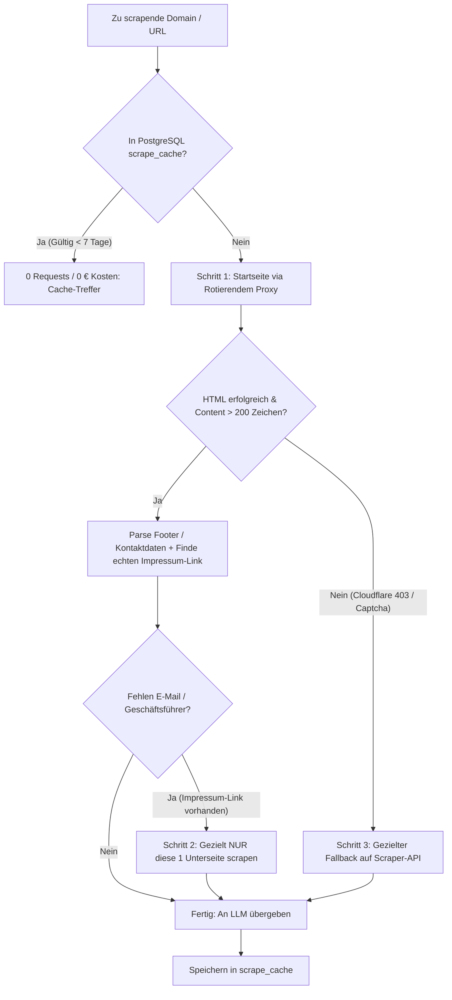

# Scraping-Architektur: IP-Schutz (Hetzner) & Kostenoptimierung

## 1. Problemstellung & Analyse

### A. Die Kostenfalle (Eden AI / Firecrawl)
* **Status:** In `lib/batch-enrich.ts` wurde für jede Firma die Startseite und anschließend blind bis zu 6 Impressums-/Kontaktpfade (`/impressum`, `/kontakt`, `/about`, etc.) via `edenScrapeUrl` abgerufen.
* **Abrechnung:** Eden AI rechnet Firecrawl nicht pauschal pro URL ab, sondern mit **$0.0038 per Token**. Eine typische Webseite liefert 5.000 bis 10.000 Tokens Text/Markdown zurück.
* **Ergebnis:** Bei 700 Firmen $\times$ bis zu 7 Seiten $\approx$ mehrere tausend Aufrufe $\rightarrow$ **$227,33 Kosten**.

### B. Das Hetzner-Risiko (IP-Reputation & Abuse)
* Wenn das System Webseiten direkt von der Hetzner-Server-IP abruft:
  1. **Abuse-Reports / Kündigung:** Webseitenbetreiber oder Sicherheitsanbieter (Cloudflare, Akamai) erkennen automatisierte Massenzugriffe und melden die IP bei Hetzner.
  2. **IP-Blacklisting:** Datacenter-IP-Ranges von Hetzner sind bei Web-Firewalls bekannt und werden schnell mit Captchas (Cloudflare 403) geblockt.

---

## 2. Ziel-Architektur (Hybrides 3-Schichten-Modell)



---

## 3. Die 4 Maßnahmen im Detail

### Maßnahme 1: Sofortige Deaktivierung der blinden Impressums-Schleife
- **Änderung in `lib/batch-enrich.ts`:**
  - Die Schleife über 6 feste Pfade (`/impressum`, `/kontakt`, `/impressum.html`, `/kontakt.html`, etc.) wird entfernt.
  - Die Startseite enthält bei 85%+ aller KMUs im Footer bereits Impressumsdaten (Telefon, E-Mail, Adresse, Name).
  - Nur wenn wesentliche Daten fehlen, wird der im Startseiten-HTML gefundene `<a>`-Tag für das Impressum extrahiert und gezielt **maximal 1 Unterseite** abgerufen.

### Maßnahme 2: Hetzner IP-Schutz durch rotierende Proxies
- **Implementierung eines Proxy-Layers (`lib/proxy-fetch.ts`):**
  - Direkte Aufrufe von der Hetzner-IP werden unterbunden.
  - Einbindung von Standard-Residential- oder Web-Proxies über `HTTP_PROXY` / `HTTPS_PROXY` Umgebungsvariablen (z. B. Smartproxy, Webshare oder BrightData).
  - **Kosten:** ca. $1 bis $3 pro **Gigabyte** Datenübertragung. Bei reinem HTML-Text (ca. 50 KB pro Seite) kosten 20.000 Webseitenabrufe weniger als $1.
  - **Sicherheit:** Zielseiten sehen reale DSL-/Mobilfunk-IPs, Hetzner-IP taucht nirgends auf.

### Maßnahme 3: Konsequentes PostgreSQL-Caching (`scrape_cache`)
- **Vor jedem Scrape:**  
  Prüfung in der Tabelle `scrape_cache`:
  ```sql
  SELECT markdown, title, fetched_at FROM scrape_cache WHERE url = $1;
  ```
- Ist der Eintrag jünger als 7 Tage: Sofortige Verwendung.  
  → Verhindert Doppel-Scrapes bei Re-Runs, Fehlversuchen oder überlappenden Cases.

### Maßnahme 4: Entkopplung von der teuren Token-Scraper-API
- Falls externe Scraper-APIs (für JS-Rendering / Cloudflare-Bypassing) genutzt werden:
  - Niemals Token-basierte Abrechnung (wie Eden AI Firecrawl mit $0.0038/Token).
  - Stattdessen Pauschalabrechnung pro URL (z. B. ScrapingBee, ScraperAPI oder eigener Playwright-Microservice `scrapling-service`).

---

## 4. Umsetzungs-Fahrplan

| Phase | Maßnahme | Erwarteter Effekt |
|---|---|---|
| **Sofort (P0)** | Blinde Impressums-Schleife in `batch-enrich.ts` entfernen (nur noch Startseite + max. 1 gezielter Link). | Senkt Eden AI Scrape-Volumen sofort um **85%**. |
| **Sofort (P0)** | Vor-Abfrage von `getCachedScrape()` vor jedem Webabruf strikt durchsetzen. | Verhindert Re-Scrapes bereits verarbeiteter Zeilen (0 € Kosten). |
| **P1** | Proxy-Support via `https-proxy-agent` in den lokalen HTTP-Fetch einbauen (`SCRAPE_PROXY_URL`). | Hetzner-Server-IP ist zu 100% vor Abuse-Reports geschützt. |
| **P2** | Lokalen Scrapling-Service (`scrapling-service/main.py`) als primären Engine-Tier nutzen, falls JS-Rendering nötig ist. | Vollständige Unabhängigkeit von externen Scraper-Abrechnungen. |
